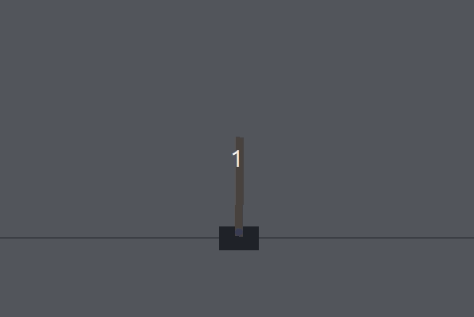

# OpenAI-Gym-Solutions - [CartPole-v1](https://github.com/openai/gym/wiki/CartPole-v0)

## Versions:

### Plain neural network implementation (NN.py):
- First collect data by playing games randomly and use the data as inputs and ouputs to train the neural network. With a quick training this model seems to easily reach 300-500 scores. This model stops training after initial training.

### DQN implementation (DQN.py):
- Use Deep Q-learning to continuously train the agent.

# Running
- Make sure virtual enviroment is active and working directory is inside the environment folder.
- Run the version you want using python3 FILENAME.