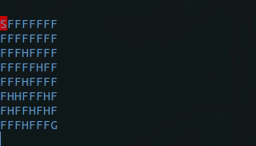

# OpenAI-Gym-Solutions - [FrozenLake8x8-v0](https://github.com/openai/gym/wiki/FrozenLake-v0/70fe29ce68e892d17500761ce2b1fb31734eb0cc)

## Versions:

### Q-learning with Q-table (Q-learning.py):
- Basic Q-learning with Q-table implemention for a simple challenge. Right now with the current setup the average solves per 10,000 episodes seems to be around 6000/10,000.

# Running
- Make sure virtual enviroment is active.
- Run the version you want using python3 FILENAME.