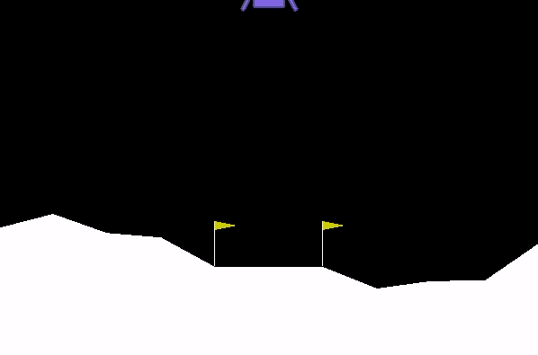

# OpenAI-Gym-Solutions - [LunarLander]()

## Versions:

### Deep Q-learning (DQN.py):
- DQN implementation with a target network. The saved model seems to act a bit odd using model_save. I'll look into this.

# Running
- Make sure virtual enviroment is active and working directory is inside the environment folder.
- Run the version you want using python3 FILENAME.