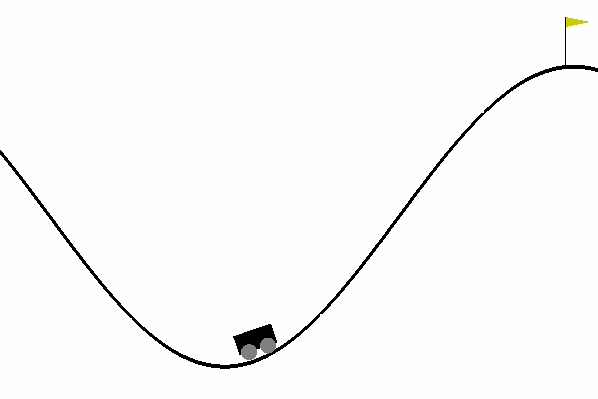

# OpenAI-Gym-Solutions - [MountainCar-v0](https://github.com/openai/gym/wiki/MountainCar-v0)

## Versions:

### Deep Q-learning (DQN.py):
- DQN implementation with a target network.

# Running
- Make sure virtual enviroment is active and working directory is inside the environment folder.
- Run the version you want using python3 FILENAME.