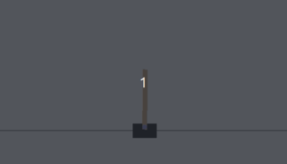

# OpenAI-Gym-Solutions

The aim of this project is to solve [OpenAI Gym](https://gym.openai.com/) environments while learning about AI / Reinforcement learning.

The results may be more or less optimal and may vary greatly in technique, as I'm both learning and experimenting with these environments.

## Completed environments (methods):
- CartPole-v1 (Plain NN, DQN).
- MountainCar-v0 (DQN)
- FrozenLake8x8-v0 (Q-table).

## In-progress (methods):
- LunarLander (DQN).

## Planning to do (in no specific order):
- CarRacing
- Acrobot
- Pendulum
- BipedalWalker(Hardcode?)
- Pong
- SpaceInvaders
- Breakout
- Ant
- Humanoid
- FetchPickAndPlace

## Requirements
- Python3, pip3.
- Virtualenv (**pip3 install virtualenv**). Version 16.7.5 used for development.

## Setup 
- Clone the repository.
- Change directory to the project root folder.
- Create a new virtual environment with **virtualenv -p python3 venv**.
- Activate the virtual environment **source venv/bin/activate**.
- Install requirements: **pip3 install -r requirements.txt**.
- Follow the instructions in each environment for running specific models.

## Update dependencies
- **pip3 freeze > requirements.txt**

## Things I will implement as soon as possible: 
- Collect and document better statistics for each model/environment to easily view/compare models and their results.
- Save top performing models. Especially when training takes time.
